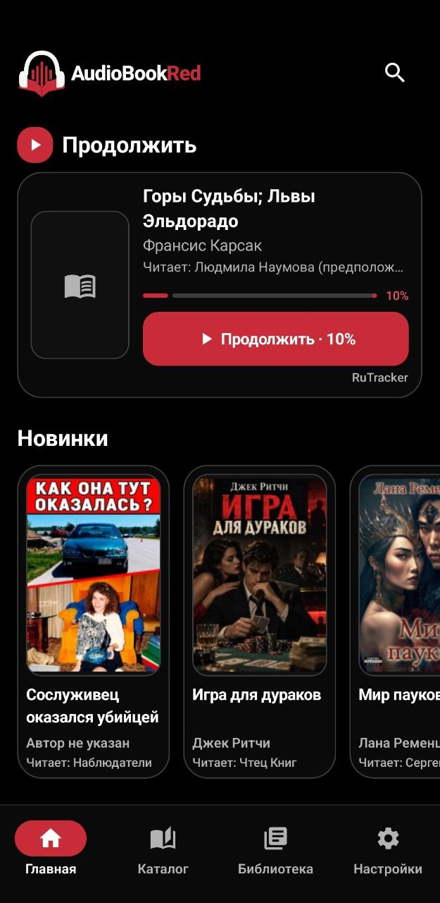
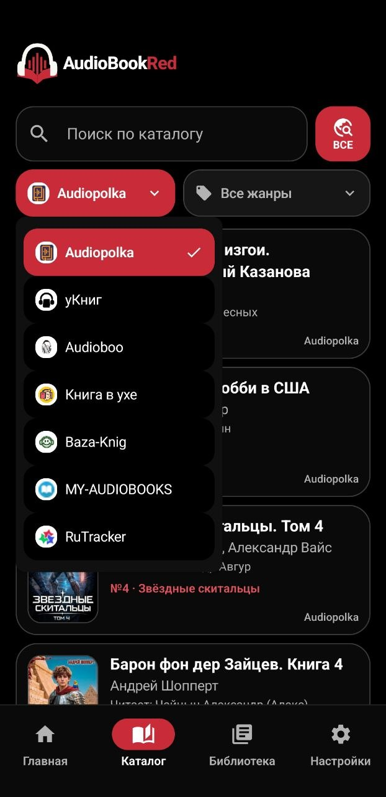
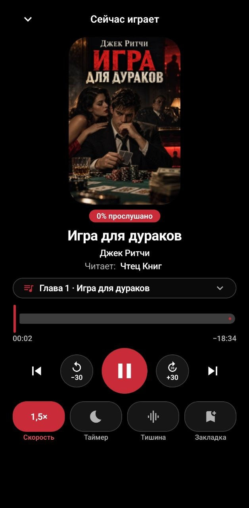
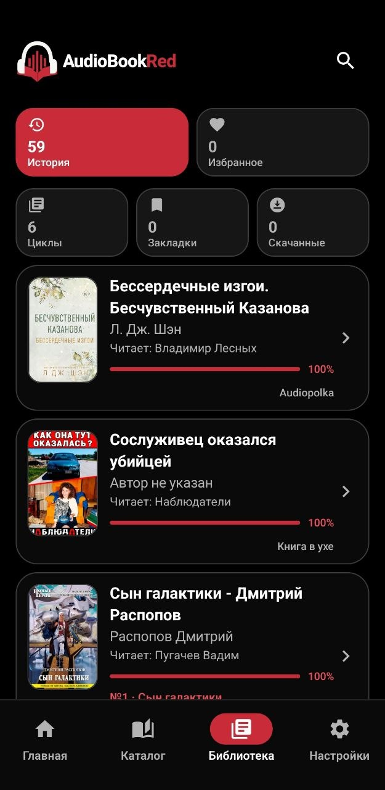
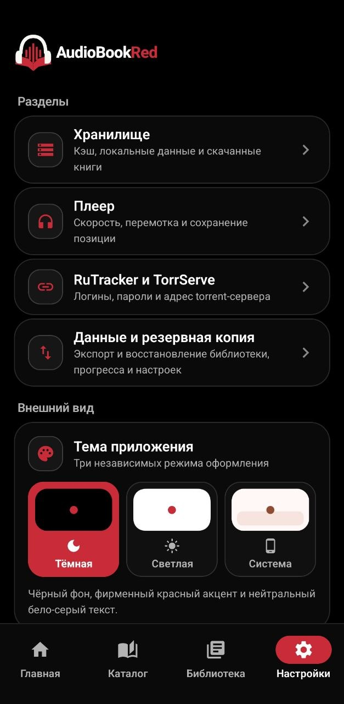

<div align="center">

# 🎧 AudioBookRed

**Android-приложение для поиска, прослушивания и локального скачивания аудиокниг из нескольких источников.**


</div>

---

## Интерфейс

<p align="center">
  
  
  
</p>

<p align="center">
  
  
</p>

## Возможности

- поиск и просмотр каталогов нескольких источников;
- карточки книг, авторы, чтецы, жанры и циклы;
- встроенный аудиоплеер с главами, скоростью, перемоткой, таймером сна, пропуском тишины и закладками;
- сохранение прогресса прослушивания;
- история, избранное, циклы и библиотека;
- локальное скачивание аудиокниг;
- резервное копирование и восстановление пользовательских данных;
- RuTracker + TorrServe;
- воспроизведение полностью скачанных книг локально;
- MediaSession и Android Auto;
- светлая, тёмная и системная темы.

Каталог, поиск и подготовка воспроизведения выполняются непосредственно на устройстве. Отдельный backend AudioBookRed для каталога и playback не используется.

## Источники

| **Источник** | **Каталог** | **Поиск** | **Прослушивание** |
| --- | :---: | :---: | :---: |
| Audiopolka | ✅ | ✅ | ✅ |
| уКниг | ✅ | ✅ | ✅ |
| Audioboo | ✅ | ✅ | ✅ |
| Книга в ухе | ✅ | ✅ | ✅ |
| Baza-Knig | ✅ | ✅ | ✅ |
| MY-AUDIOBOOKS | ✅ | ✅ | ✅ |

> Доступность конкретного источника зависит от его текущей работы и структуры страниц.

### RuTracker

RuTracker поддерживается как отдельный источник аудиокниг. Для **прослушивания и скачивания** требуется настроенный **TorrServe**.

После полного скачивания аудиокнига может воспроизводиться локально без TorrServe.

## Техническая часть

Проект написан на Kotlin и использует современный Android-стек:

- Jetpack Compose;
- AndroidX Media3 / ExoPlayer / MediaSession;
- Room;
- Paging 3;
- Hilt;
- WorkManager;
- OkHttp;
- Kotlin Coroutines;
- KSP.

Минимальная версия Android — **7.0 (API 24)**.

Для внешних сервисов RuTracker и TorrServe пользовательские логины и пароли задаются в приложении. Пароли сохраняются локально и шифруются через Android Keystore.

## Сборка

Требования:

- JDK 17;
- Android SDK;
- Android platform `android-37.0`;
- Build Tools `37.0.0`.

Проверка проекта:

```bash
./gradlew --no-daemon testDebugUnitTest
./gradlew --no-daemon compileDebugAndroidTestKotlin
./gradlew --no-daemon lintDebug
```

Сборка debug APK:

```bash
./gradlew --no-daemon assembleDebug
```

Debug-сборка использует applicationId `com.aistudio.audiobookred.player.debug` и может быть установлена рядом с основной версией приложения.

## Лицензия

Проект распространяется на условиях **GNU Affero General Public License v3.0 (AGPL-3.0-only)**.

Полный текст лицензии находится в файле [LICENSE](LICENSE).
